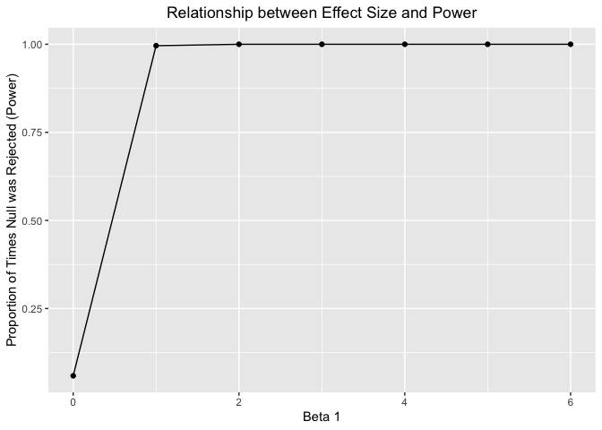

Homework \#5
================
Sophia Miller
11/3/2019

# Problem 1

First, we will load the `iris` dataset and introduce missing values in
each column:

``` r
set.seed(10)
library(tidyverse)

set.seed(10)

iris_with_missing = iris %>% 
  map_df(~replace(.x, sample(1:150, 20), NA)) %>%
  mutate(Species = as.character(Species))
```

The function below replaces missing values according to the following
rules:

  - For numeric variables, missing values are filled in with the mean of
    non-missing values
  - For character values, missing values are filled in with
    `"virginica"`

<!-- end list -->

``` r
replace_missing = function(x) {
  
   if (is.numeric(x)) {
    ifelse(is.na(x), mean(x, na.rm = TRUE), x)
   } else if (is.character(x)) {
     ifelse(is.na(x), "virginica", x)
   }
     
}

iris_complete = map_df(iris_with_missing, replace_missing)
```

# Problem 3

Here, we run a simluation to explore power:

``` r
sim_regression = function(n = 30, beta0 = 2, beta1 = 0) {
  
  sim_data = tibble(
    x = rnorm(n, mean = 0, sd = 50),
    y = beta0 + beta1 * x + rnorm(n, 0, 50)
  )
  
  ls_fit = lm(y ~ x, data = sim_data)
  tidy(ls_fit) %>% 
    filter(term == "x")

}

#run function for beta1 = 0 first
sim_results = 
  rerun(1000, sim_regression()) %>% 
  bind_rows

#Now run function for beta1 = 0,1,2,3,4,5,6
sim_results1 = 
  tibble(
    beta1 = c(0, 1, 2, 3, 4, 5, 6)) %>% 
  mutate(
    output_list = map(.x = beta1, ~rerun(1000, sim_regression(beta1 = .x))),
    estimate_dfs = map(output_list, bind_rows)) %>% 
  select(-output_list) %>% 
  unnest(estimate_dfs)
```

``` r
sim_results1 %>% 
  mutate(reject = ifelse(p.value <= 0.05, "significant", "non-significant")) %>% 
  group_by(beta1, reject) %>% 
  summarize(significant_count = n()) %>% 
  filter(reject == "significant") %>% 
  mutate(significant_rate = significant_count/1000) %>% 
  ggplot(aes(x = beta1, y = significant_rate)) + 
  geom_line() +
  geom_point() +
  labs(
    title = "Relationship between Effect Size and Power",
    x = "Beta 1",
    y = "Proportion of Times Null was Rejected (Power)"
  ) +
  theme(plot.title = element_text(hjust = 0.5))
```

<!-- -->
