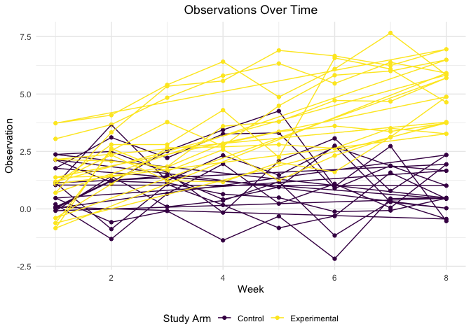
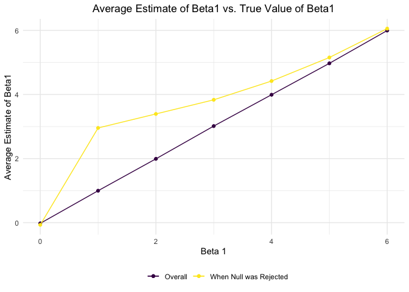

Homework \#5
================
Sophia Miller
11/3/2019

# Problem 1

First, we will load the `iris` dataset and introduce missing values in
each column:

``` r
set.seed(10)
library(tidyverse)

set.seed(10)

iris_with_missing = iris %>% 
  map_df(~replace(.x, sample(1:150, 20), NA)) %>%
  mutate(Species = as.character(Species))
```

The function below replaces missing values according to the following
rules:

  - For numeric variables, missing values are filled in with the mean of
    non-missing values
  - For character values, missing values are filled in with
    `"virginica"`

<!-- end list -->

``` r
replace_missing = function(x) {
  
   if (is.numeric(x)) {
    ifelse(is.na(x), mean(x, na.rm = TRUE), x)
   } else if (is.character(x)) {
     ifelse(is.na(x), "virginica", x)
   }
     
}

iris_complete = map_df(iris_with_missing, replace_missing)
```

# Problem 2

In this problem, we are creating a tidy data frame containing data from
20 csv files from a longitudinal study (10 control participants and 10
experimental participants) and plotting observations for each subject
over time

``` r
read_data = function(path) {
  df = read_csv(path)
  df
}

directory_base = "./data/"

complete = tibble(
  participant = list.files(path = "./data"), 
  values = str_c(directory_base, participant)) %>% 
    mutate(
    data = (map(values, read_data))) %>%
  unnest(cols = data) %>% 
  pivot_longer(
    week_1:week_8, 
    names_to = "week",
    values_to = "value") %>% 
  separate(participant, c("arm", "id")) %>% 
  separate(week, c("week_label", "week")) %>% 
  select(-values, -week_label) %>% 
  mutate(
    id = as.numeric(id),
    week = as.numeric(week))
  
complete = as.data.frame(complete)

ggplot(complete, aes(x = week, y = value)) +
  geom_line(aes(group = id, color = arm))
```

<!-- -->

# Problem 3

Here, we run a simluation to explore power:

``` r
sim_regression = function(n = 30, beta0 = 2, beta1 = 0) {
  
  sim_data = tibble(
    x = rnorm(n, mean = 0, sd = 1),
    y = beta0 + beta1 * x + rnorm(n, 0, 50^0.50)
  )
  
  ls_fit = lm(y ~ x, data = sim_data)
  tidy(ls_fit) %>% 
    filter(term == "x")

}

#run function for beta1 = 0 first
sim_results = 
  rerun(100, sim_regression()) %>% 
  bind_rows

#now run function for beta1 = 0,1,2,3,4,5,6
sim_results1 = 
  tibble(
    beta1 = c(0, 1, 2, 3, 4, 5, 6)) %>% 
  mutate(
    output_list = map(.x = beta1, ~rerun(100, sim_regression(beta1 = .x))),
    estimate_dfs = map(output_list, bind_rows)) %>% 
  select(-output_list) %>% 
  unnest(estimate_dfs)
```

``` r
sim_results1 %>% 
  mutate(reject = ifelse(p.value <= 0.05, "significant", "non-significant")) %>% 
  filter(reject == "significant") %>% 
  group_by(beta1) %>% 
  mutate(significant_count = n()) %>% 
  distinct(.keep_all = TRUE) %>%
  mutate(significant_rate = significant_count/1000) %>% 
  ggplot(aes(x = beta1, y = significant_rate)) + 
  geom_col()
```

<!-- -->

Plotting average estimate of beta 1 vs. true value of beta 1

``` r
sim_results1 %>%
  group_by(beta1) %>% 
  summarize(mean_estimate = mean(estimate)) %>%
  ggplot(aes(x = beta1, y = mean_estimate)) +
  geom_line() +
  geom_point() +
  labs(
    title = "Average Estimate of Beta 1 vs. True Value of Beta 1",
    x = "Beta 1",
    y = "Average Estimate of Beta 1"
  ) +
  theme(plot.title = element_text(hjust = 0.5))
```

<!-- -->

Plotting average estimate of beta 1 vs. true value of beta 1 for samples
where null was rejected:

``` r
sim_results1 %>% 
  mutate(reject = ifelse(p.value <= 0.05, "significant", "non-significant")) %>%
  filter(reject == "significant") %>% 
  group_by(beta1) %>% 
  summarize(mean_estimate = mean(estimate)) %>%
  ggplot(aes(x = beta1, y = mean_estimate)) +
  geom_line() +
  geom_point() +
  labs(
    title = "Average Estimate of Beta 1 vs. True Value of Beta 1, When Null was Rejected",
    x = "Beta 1",
    y = "Average Estimate of Beta 1"
  ) +
  theme(plot.title = element_text(hjust = 0.5))
```

<!-- -->
